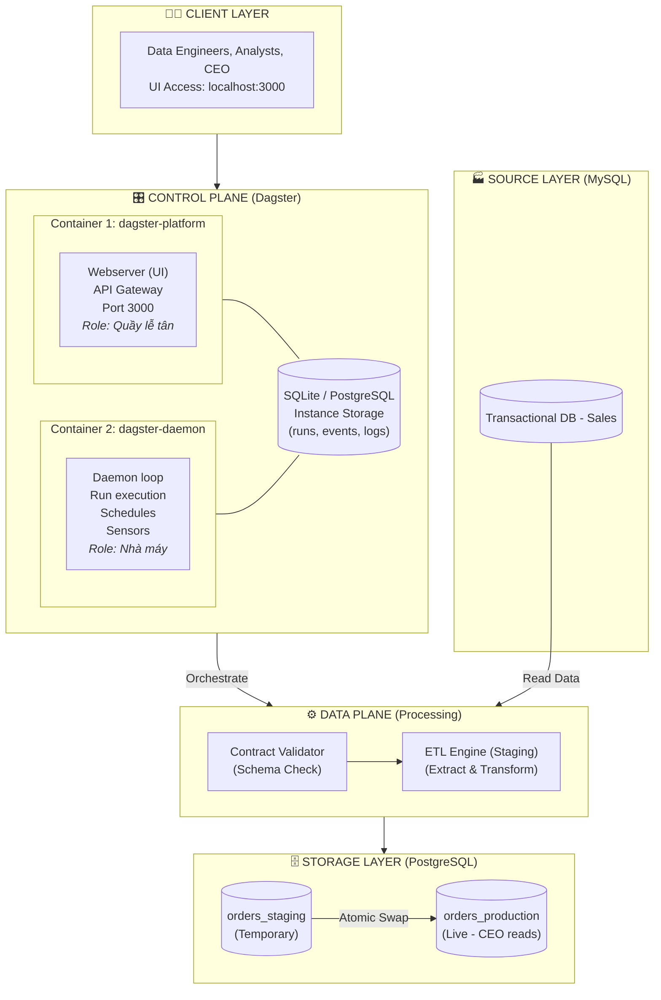

# 🏛️ Data Platform Architecture - Production-Grade Lab

**Version:** 1.0  
**Status:** Approved  
**Owner:** Platform Engineering Team

---

## 1. Executive Summary (Tóm tắt điều hành)

Dự án này xây dựng một **Data Platform Self-serve** trên môi trường On-prem, mô phỏng kiến trúc Production-grade. Mục tiêu không chỉ là chạy được ETL, mà là xây dựng một **sản phẩm nội bộ** phục vụ Data Engineers với tiêu chuẩn SRE cao nhất: **Đáng tin cậy (Reliable), Dễ quan sát (Observable), và Dễ phục hồi (Resilient).**

---

## 2. Architecture Principles (Nguyên lý kiến trúc)

1. **Data as a Product:** Dữ liệu không phải là phế phẩm của script, nó là một sản phẩm có SLA, có Contract, và có khách hàng (Data Analysts, CEO).
2. **Assume Failure (SRE Lens):** Mọi pipeline đều sẽ chết. Câu hỏi không phải là "nếu nó chết", mà là "khi nó chết, blast radius là bao nhiêu và phục hồi thế nào?".
3. **Separation of Concerns:** Platform Team quản lý hạ tầng (Control Plane). Data Team quản lý logic dữ liệu (Data Plane). Không ai dẫm chân lên ai.
4. **Immutability:** Code và hạ tầng được đóng gói thành versioned artifacts. Không sửa đổi trực tiếp trên môi trường đang chạy.
5. **Fail-Fast over Silent Corruption:** Thà dừng hệ thống và báo lỗi ngay lập tức còn hơn để dữ liệu bẩn chảy vào Production mà không ai hay biết.

---

## 3. Core DataOps Patterns (Mẫu hình DataOps cốt lõi)

### 3.1. Idempotency via Atomic Swap (Pattern C)

- **Vấn đề:** Truncate & Load trực tiếp gây rủi ro Data Blackout. Upsert/Merge tốn tài nguyên Index lookup khi dữ liệu lớn.
- **Giải pháp:**
  1. Load dữ liệu mới vào bảng `orders_staging` (ẩn).
  2. Chạy Data Quality Checks trên bảng Staging.
  3. Nếu Pass, thực hiện **Atomic Swap**: Đổi tên `orders_staging` → `orders_production` và ngược lại.
  4. Nếu Fail, hủy bảng Staging. Bảng Production cũ vẫn nguyên vẹn.
- **Lợi ích:** Zero-downtime deployment cho dữ liệu. Tương tự Blue/Green Deployment trong DevOps.

### 3.2. Data Contracts & Schema Validation

- **Vấn đề:** Source DB thay đổi schema ngầm (Silent Failure) làm hỏng pipeline downstream.
- **Giải pháp:** Đặt một **Contract Validator** ở đầu pipeline. Nó so sánh schema thực tế của Source với bản Contract đã thỏa thuận.
- **Hành vi khi vi phạm:** **FAIL-FAST**. Dừng toàn bộ pipeline, gửi Alert, không cho phép bất kỳ dữ liệu nào đi vào Staging.

---

## 4. System Architecture (Kiến trúc hệ thống)

### 4.1. Component Diagram (Sơ đồ thành phần)

> **Tách Webserver và Daemon thành 2 container là quyết định production-grade:**
> - **Blast radius nhỏ hơn**: restart UI không ảnh hưởng runs đang chạy.
> - **Scale độc lập**: có thể chạy 1 webserver + N daemon (tuy nhiên lab này chỉ cần 1–1).
> - **Healthcheck riêng biệt**: webserver cần probe HTTP, daemon cần probe heartbeat khác.
> - **Migrate K8s dễ dàng**: mỗi container tương ứng 1 Deployment độc lập.
>
> ⚠️ **Không chạy chung 2 process trong 1 container bằng supervisor**: vi phạm
> nguyên tắc "one process per container" và khiến Docker không thể quản lý lifecycle đúng.
### 4.2. Technology Stack

| Layer | Technology | Justification (Tại sao chọn?) |
|-------|-----------|--------------------------------|
| **Orchestrator** | **Dagster** | Asset-centric mindset. Hỗ trợ Data Contracts, Lineage UI trực quan. Nhẹ hơn Airflow, phù hợp On-prem lab. |
| **Source DB** | **MySQL 8.0** | Phổ biến, dễ cài đặt, mô phỏng tốt hệ thống transactional. |
| **Target DB** | **PostgreSQL 15** | Hỗ trợ ACID mạnh, transactional DDL tốt cho Atomic Swap. |
| **Containerization** | **Docker Compose** | Phù hợp On-prem resource constraint. Dễ quản lý hơn K8s cho lab. |
| **Language** | **Python 3.10+** | Ngôn ngữ chuẩn của Data Engineering. |

---

## 5. Data Flow (Luồng dữ liệu chi tiết)

### 5.1. Happy Path (Luồng thành công)

1. **Trigger:** Dagster Daemon đánh thức pipeline lúc 06:00 AM.
2. **Step 1 - Validate:** `Contract Validator` kết nối MySQL, đọc schema bảng `orders`. So sánh với Contract (cột `order_id`, `amount`, `created_at`). → **PASS**.
3. **Step 2 - Extract & Load Staging:** `ETL Engine` kết nối MySQL, SELECT dữ liệu 24h qua. INSERT vào bảng `orders_staging` trong PostgreSQL.
4. **Step 3 - Quality Check:** Kiểm tra `orders_staging` không bị NULL primary key, không bị âm doanh thu. → **PASS**.
5. **Step 4 - Atomic Swap:** Dagster chạy transaction:

```sql
   BEGIN;
   ALTER TABLE orders_production RENAME TO orders_backup;
   ALTER TABLE orders_staging RENAME TO orders_production;
   DROP TABLE orders_backup;
   COMMIT;
```

6. **Step 5 - Notify:** Gửi Alert Success. CEO mở dashboard thấy dữ liệu mới.

### 5.2. Failure Path: Schema Drift (Luồng lỗi Schema)

1. **Trigger:** 06:00 AM.
2. **Step 1 - Validate:** Source DB đã đổi tên cột `order_id` → `transaction_id`. Contract Validator phát hiện sai lệch. → **FAIL**.
3. **Hành động:**
   - Pipeline **DỪNG NGAY LẬP TỨC**. Không chạy Step 2, 3, 4.
   - Dagster UI hiển thị Asset `orders_staging` trạng thái **FAILED**.
   - Asset downstream `orders_production` và `ceo_dashboard` chuyển trạng thái **AT RISK / STALE**.
   - Gửi Alert chi tiết: *"Schema Violation: Expected 'order_id', found 'transaction_id'"*.
4. **Kết quả:** Bảng `orders_production` vẫn chứa dữ liệu cũ (an toàn). Không có Data Blackout. Data Engineer biết chính xác nguyên nhân để sửa.

---

## 6. Infrastructure Design (Thiết kế hạ tầng Docker Compose)

### 6.1. Service Decomposition

| Service Name | Role | Port | Healthcheck | Dependency |
|--------------|------|------|--------------|------------|
| `mysql-source` | Source DB | 3306 | `mysqladmin ping` | None |
| `postgres-target` | Target DB | 5432 | `pg_isready` | None |
| `dagster-platform` | Dagster Webserver (UI + API) | 3000 | HTTP check `/health` | `mysql-source` (healthy), `postgres-target` (healthy) |
| `dagster-daemon` | Dagster Daemon (Run Execution) | — | Disabled* | `mysql-source` (healthy), `postgres-target` (healthy) |

\* Daemon không expose HTTP endpoint, nên không có healthcheck HTTP. Thay vào đó, Dagster tự theo dõi heartbeat của daemon và cảnh báo trên UI tab **Deployment** nếu daemon ngừng heartbeat.

#### Immutability Pattern: "Same Image, Different Command"

Hai service `dagster-platform` và `dagster-daemon` được build từ **cùng một Dockerfile**,
chỉ khác nhau ở `command`:

| Service           | Command                                                          |
|-------------------|------------------------------------------------------------------|
| dagster-platform  | `dagster-webserver -h 0.0.0.0 -p 3000 -w .../workspace.yaml`    |
| dagster-daemon    | `dagster-daemon run -w .../workspace.yaml`                       |

**Lợi ích:**
- Artifact duy nhất (một image), giảm attack surface và storage.
- Đảm bảo cả 2 process dùng cùng version code, cùng dependencies → không có version drift.
- Khi migrate sang K8s, chỉ cần tạo 2 Deployment dùng cùng `image:tag`, override `command` ở từng nơi.

### 6.2. Networking & Security

- **Network:** Tất cả services nằm trong bridge network `dataops-network`. Giao tiếp qua **Service Discovery** (DNS nội bộ của Docker).
- **Secrets:** Credentials KHÔNG hardcode trong `docker-compose.yml`. Sử dụng file `.env` và thêm vào `.gitignore`.
- **Ports:** Chỉ expose ports cần thiết cho việc debug lab (3306, 5432, 3000). Trong production thực tế, ports DB sẽ bị chặn hoàn toàn.

### 6.3. Storage Strategy

- **Databases:** Sử dụng **Named Volumes** (`mysql_data`, `postgres_data`) để đảm bảo dữ liệu tồn tại qua các lần restart. Đây là Stateful workload.
- **Code (Production Mode):** Code Python được **COPY** vào Docker Image qua Dockerfile. Đảm bảo tính bất biến (Immutability).
- **Code (Dev Mode - Optional):** Có thể dùng **Bind Mount** để tăng tốc độ feedback loop khi phát triển, nhưng phải hiểu rõ rủi ro về version control.

---

## 7. Operational Readiness (Sẵn sàng vận hành)

> Tham khảo Mini-PRR của từng pipeline trong [docs/reliability/](./docs/reliability/).

### 7.1. SLO / SLA Design

- **Data Freshness:** 95% số ngày trong tháng, dữ liệu `orders_production` phải sẵn sàng trước **07:30 AM**.
- **Data Correctness:** Tỷ lệ bản ghi lỗi (NULL key, sai format) không vượt quá **0.1%**.
- **Pipeline Availability:** Orchestrator UI phải khả dụng **99.5%** thời gian làm việc.

### 7.2. Observability (Khả năng quan sát)

- **Logs:** Toàn bộ log của từng step được Dagster thu thập và hiển thị trên UI. Data Engineer có thể tự debug mà không cần SSH vào server.
- **Lineage:** UI hiển thị đồ thị phụ thuộc giữa các Assets. Xác định Blast Radius ngay lập tức khi có lỗi.
- **Alerts:** *(Tương lai)* Tích hợp Slack/Email cho các sự kiện: Schema Violation, Quality Check Failed, Freshness SLO Breach.

### 7.3. Disaster Recovery (Phục hồi thảm họa)

- Nếu Atomic Swap fail giữa chừng: Transaction bị rollback. Bảng Production không bị ảnh hưởng.
- Nếu PostgreSQL Volume bị hỏng: Restore từ backup (cần thiết lập backup job riêng - ngoài phạm vi lab này).
- Nếu Dagster Container crash: Docker restart tự động (`restart: always`). Các Run đang dang dở sẽ được đánh dấu failed và có thể Retry từ UI.

### 7.4. Control Plane Health & Split-Brain Prevention

Dagster Daemon sử dụng cơ chế **leader election bằng heartbeat** trên Instance Storage
để ngăn chặn tình trạng nhiều daemon chạy đồng thời (split-brain).

#### Cơ chế hoạt động
1. Mỗi daemon process có một `daemon_id` duy nhất (UUID random).
2. Daemon ghi heartbeat vào Instance Storage mỗi ~30 giây.
3. Nếu một daemon khác thấy heartbeat của daemon lạ còn mới, nó sẽ **từ chối thực thi**
   và ghi log cảnh báo: *"Another <X> daemon is still sending heartbeats."*
4. Chỉ daemon đang giữ lock mới thực sự thực thi runs, schedules, sensors.

#### Tình huống thường gặp trong lab

| Tình huống | Hậu quả | Cách xử lý |
|---|---|---|
| Chạy `docker exec -d dagster-daemon run` thủ công | 2 daemon cùng chạy, tranh lock, log ERROR liên tục | `docker compose restart` container liên quan |
| Xóa container nhưng không xóa volume | Heartbeat cũ còn tồn tại, daemon mới tưởng có đối thủ | Đợi 60s để heartbeat cũ timeout |
| Instance storage corrupt | Daemon không thể ghi heartbeat, mọi runs queued | Restore từ backup (production) |

#### SLI đề xuất cho Production

| SLI | Ngưỡng alert |
|---|---|
| Daemon heartbeat freshness | > 2 phút không có heartbeat |
| Time a run spends in `QUEUED` state | > 5 phút |
| Number of active daemon processes | ≠ 1 (split-brain) |

> 💡 **Bài học từ lab:** Shadow process tạo ra bởi `docker exec` là kẻ thù
> của vận hành production. Luôn ưu tiên *recreate artifact* (build lại image,
> recreate container) thay vì *mutate container đang chạy*.

---

## 8. Future Roadmap (Lộ trình mở rộng)

1. **Phase 2:** Tách riêng `Contract Validator` thành một microservice độc lập để scale riêng.
2. **Phase 3:** Thay thế Docker Compose bằng Kubernetes (EKS) khi chuyển lên AWS. Sử dụng Helm Charts.
3. **Phase 4:** Tích hợp **Great Expectations** hoặc **Soda** làm engine Data Quality chuyên sâu hơn.
4. **Phase 5:** Triển khai **CDC (Change Data Capture)** với Debezium thay vì Batch Load.

---

*Document maintained by Platform Engineering Team. Any changes require Architecture Review.*