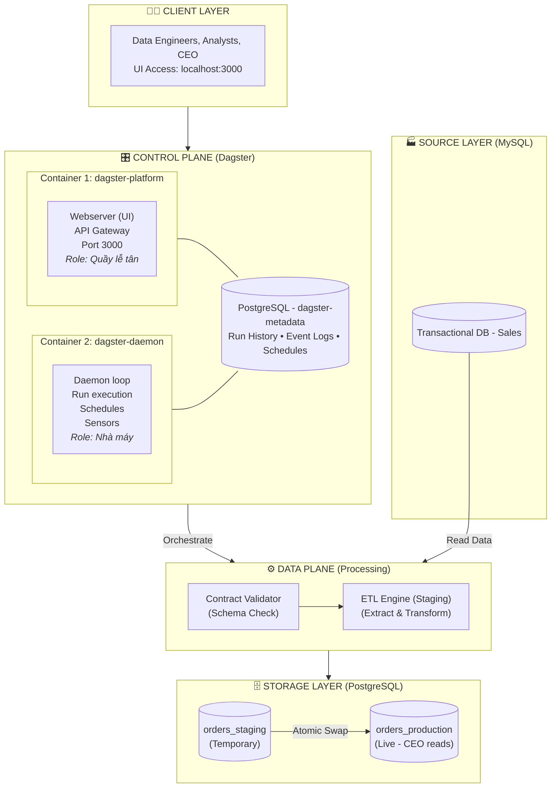

# 🏛️ Data Platform Architecture - Production-Grade Lab

**Version:** 1.1  
**Status:** Approved  
**Owner:** Platform Engineering Team  

## Change Log

| Version | Date | Change |
|---|---|---|
| 1.0 | Initial version | Architecture gốc với Atomic Swap, Data Contract, Control Plane / Data Plane separation |
| 1.1 | Current | Bổ sung concurrency control, run-scoped staging, orphan cleanup, advisory lock, backup retention |

---

## 1. Executive Summary (Tóm tắt điều hành)

Dự án này xây dựng một **Data Platform Self-serve** trên môi trường On-prem, mô phỏng kiến trúc Production-grade. Mục tiêu không chỉ là chạy được ETL, mà là xây dựng một **sản phẩm nội bộ** phục vụ Data Engineers với tiêu chuẩn SRE cao nhất: **Đáng tin cậy (Reliable), Dễ quan sát (Observable), và Dễ phục hồi (Resilient).**

---

## 2. Architecture Principles (Nguyên lý kiến trúc)

1. **Data as a Product:** Dữ liệu không phải là phế phẩm của script, nó là một sản phẩm có SLA, có Contract, và có khách hàng (Data Analysts, CEO).
2. **Assume Failure (SRE Lens):** Mọi pipeline đều sẽ chết. Câu hỏi không phải là "nếu nó chết", mà là "khi nó chết, blast radius là bao nhiêu và phục hồi thế nào?".
3. **Separation of Concerns:** Platform Team quản lý hạ tầng (Control Plane). Data Team quản lý logic dữ liệu (Data Plane). Không ai dẫm chân lên ai.
4. **Immutability:** Code và hạ tầng được đóng gói thành versioned artifacts. Không sửa đổi trực tiếp trên môi trường đang chạy.
5. **Fail-Fast over Silent Corruption:** Thà dừng hệ thống và báo lỗi ngay lập tức còn hơn để dữ liệu bẩn chảy vào Production mà không ai hay biết.

---

## 3. Core DataOps Patterns (Mẫu hình DataOps cốt lõi)

### 3.1. Idempotency via Atomic Swap + Single-flight Execution (Pattern C+)

**Vấn đề:**

- Truncate & Load trực tiếp gây rủi ro Data Blackout.
- Upsert/Merge tốn tài nguyên index lookup khi dữ liệu lớn.
- Nếu có hai pipeline runs chạy đồng thời, bảng staging cố định có thể bị conflict.
- Nếu run trước crash giữa chừng, run sau có thể kế thừa trạng thái staging không rõ nguồn gốc.

**Giải pháp:**

Pipeline hiện tại kết hợp nhiều lớp bảo vệ:

1. **Single-flight execution ở Control Plane**
   - Dùng `QueuedRunCoordinator`.
   - `max_concurrent_runs: 1`.
   - Tại một thời điểm chỉ có một Dagster run được thực thi.
   - Các run khác sẽ ở trạng thái `QUEUED`.

2. **Run-scoped staging table**
   - Mỗi run tạo một bảng staging riêng, ví dụ: `orders_stg_20260616123045_ab12cd34`.
   - Tránh conflict nếu có race condition hoặc cấu hình sai.
   - Dễ forensic và debug.

3. **Orphan staging cleanup**
   - Ở đầu bước staging, pipeline dọn dẹp các bảng `orders_stg_*` orphan từ run trước.
   - An toàn vì Control Plane đang giới hạn single-flight.

4. **Data Quality Checks trước khi swap**
   - Kiểm tra NULL ở các cột bắt buộc.
   - Kiểm tra `amount < 0`.
   - Kiểm tra duplicate `order_id`.
   - Kiểm tra row count tối thiểu.

5. **Atomic Swap với advisory lock**
   - Swap được thực hiện trong một PostgreSQL transaction.
   - Dùng `pg_advisory_xact_lock` để giảm rủi ro concurrent swap.

6. **Backup retention một thế hệ**
   - Bảng production cũ được rename thành `orders_production_backup`.
   - Backup này được giữ lại cho đến lần swap kế tiếp.
   - Hỗ trợ rollback ngắn hạn.

**Luồng swap hiện tại:**

```sql
BEGIN;
SELECT pg_advisory_xact_lock(906033);
DROP TABLE IF EXISTS orders_production_backup;
ALTER TABLE orders_production RENAME TO orders_production_backup;
ALTER TABLE orders_stg_<run_id> RENAME TO orders_production;
COMMIT;
```

**Lợi ích:**

- Zero-downtime deployment cho dữ liệu.
- Không có Data Blackout.
- Production cũ vẫn có thể dùng để rollback ngắn hạn.
- Giảm rủi ro concurrent execution.
- Tăng khả năng phục hồi và forensic.

### 3.2. Data Contracts & Schema Validation

- **Vấn đề:** Source DB thay đổi schema ngầm (Silent Failure) làm hỏng pipeline downstream.
- **Giải pháp:** Đặt một **Contract Validator** ở đầu pipeline. Nó so sánh schema thực tế của Source với bản Contract đã thỏa thuận.
- **Hành vi khi vi phạm:** **FAIL-FAST**. Dừng toàn bộ pipeline, gửi Alert, không cho phép bất kỳ dữ liệu nào đi vào Staging.


### 3.3. Concurrency Control & State Ownership

**Vấn đề:**

Data Pipeline không chỉ cần đúng về mặt dữ liệu, mà còn cần an toàn khi có nhiều người hoặc nhiều trigger cùng lúc:

- Hai Data Engineer cùng bấm Materialize.
- Schedule trigger trong khi một manual run đang chạy.
- Run trước crash và để lại staging orphan.
- Retry một run cũ sau khi đã có run mới.

**Thiết kế hiện tại:**

| Cơ chế | Mục đích |
|---|---|
| `QueuedRunCoordinator` | Giới hạn số run chạy đồng thời |
| `max_concurrent_runs: 1` | Single-flight execution cho lab hiện tại |
| Run-scoped staging table | Tránh conflict giữa các run |
| Orphan staging cleanup | Dọn dẹp trạng thái còn sót lại từ run trước |
| PostgreSQL advisory lock | Serialize bước Atomic Swap |
| Backup retention một thế hệ | Hỗ trợ rollback ngắn hạn |

**Hành vi vận hành:**

- Nếu có nhiều run được trigger, chỉ một run chạy tại một thời điểm.
- Các run còn lại ở trạng thái `QUEUED`.
- `QUEUED` không phải lỗi, đây là hành vi bảo vệ hệ thống.
- Nếu run queued quá lâu, cần kiểm tra daemon và run queue.

**SLI gợi ý:**

| SLI | Ngưỡng cảnh báo |
|---|---|
| Time a run spends in QUEUED state | > 5 phút |
| Number of concurrently running runs | > 1 |
| Orphan staging tables after successful run | > 0 |
| Number of production backup tables | > 1 |
---

## 4. System Architecture (Kiến trúc hệ thống)

### 4.1. Component Diagram (Sơ đồ thành phần)

> **Tách Webserver và Daemon thành 2 container là quyết định production-grade:**
> - **Blast radius nhỏ hơn**: restart UI không ảnh hưởng runs đang chạy.
> - **Scale độc lập**: có thể chạy 1 webserver + N daemon (tuy nhiên lab này chỉ cần 1–1).
> - **Healthcheck riêng biệt**: webserver cần probe HTTP, daemon cần probe heartbeat khác.
> - **Migrate K8s dễ dàng**: mỗi container tương ứng 1 Deployment độc lập.
>
> ⚠️ **Không chạy chung 2 process trong 1 container bằng supervisor**: vi phạm
> nguyên tắc "one process per container" và khiến Docker không thể quản lý lifecycle đúng.
### 4.2. Technology Stack

| Layer | Technology | Justification (Tại sao chọn?) |
|-------|-----------|--------------------------------|
| **Orchestrator** | **Dagster** | Asset-centric mindset. Hỗ trợ Data Contracts, Lineage UI trực quan. Nhẹ hơn Airflow, phù hợp On-prem lab. |
| **Source DB** | **MySQL 8.0** | Phổ biến, dễ cài đặt, mô phỏng tốt hệ thống transactional. |
| **Target DB** | **PostgreSQL 15** | Hỗ trợ ACID mạnh, transactional DDL tốt cho Atomic Swap. |
| **Containerization** | **Docker Compose** | Phù hợp On-prem resource constraint. Dễ quản lý hơn K8s cho lab. |
| **Language** | **Python 3.10+** | Ngôn ngữ chuẩn của Data Engineering. |

---

## 5. Data Flow (Luồng dữ liệu chi tiết)

### 5.1. Happy Path (Luồng thành công)

1. **Trigger**
   - Data Engineer bấm Materialize từ UI, hoặc chạy `orders_pipeline_job`.
   - Nếu đã có một run đang chạy, run mới sẽ ở trạng thái `QUEUED`.

2. **Step 1 - Validate**
   - `Contract Validator` kết nối MySQL.
   - Đọc schema thực tế của bảng `orders`.
   - So sánh với Data Contract.
   - Nếu pass, pipeline tiếp tục.
   - Nếu fail, pipeline dừng ngay lập tức.

3. **Step 2 - Extract & Load to Run-scoped Staging**
   - ETL Engine đọc dữ liệu từ MySQL.
   - Cleanup các bảng staging orphan nếu có.
   - Tạo bảng staging mới theo run, ví dụ:
     `orders_stg_20260616123045_ab12cd34`.
   - Insert dữ liệu vào bảng staging.

4. **Step 3 - Quality Check**
   - Kiểm tra NULL ở các cột bắt buộc.
   - Kiểm tra `amount < 0`.
   - Kiểm tra duplicate `order_id`.
   - Kiểm tra row count tối thiểu.
   - Nếu fail, pipeline dừng và không swap vào production.

5. **Step 4 - Atomic Swap**
   - PostgreSQL transaction thực hiện:
     - Lấy advisory lock.
     - Drop backup cũ nếu có.
     - Rename `orders_production` hiện tại thành `orders_production_backup`.
     - Rename bảng staging theo run thành `orders_production`.
     - Commit.

6. **Step 5 - Post-swap state**
   - `orders_production` chứa dữ liệu mới.
   - `orders_production_backup` chứa dữ liệu của thế hệ production trước.
   - Không còn bảng staging của run hiện tại.

7. **Step 6 - Notify / Observe**
   - Dagster UI hiển thị run succeeded.
   - Asset lineage thể hiện trạng thái success.
   - CEO/Data Analyst có thể đọc dữ liệu mới từ `orders_production`.

### 5.2. Failure Path: Schema Drift

Hành vi vẫn giữ nguyên:

- Contract Validator phát hiện schema drift.
- Pipeline fail-fast.
- Không có dữ liệu nào đi vào staging.
- Không có Atomic Swap.
- `orders_production` vẫn chứa dữ liệu cũ.

### 5.3. Failure Path: Run Crash ở Staging

Nếu run crash sau khi tạo staging nhưng trước khi swap:

- Bảng staging theo run có thể còn tồn tại.
- Run kế tiếp sẽ cleanup các bảng staging orphan ở đầu bước staging.
- Production không bị ảnh hưởng nếu swap chưa xảy ra.

### 5.4. Failure Path: Atomic Swap Fail

Nếu Atomic Swap fail trước khi commit:

- PostgreSQL rollback transaction.
- `orders_production` cũ vẫn an toàn.
- Bảng staging có thể còn tồn tại.
- Run kế tiếp sẽ cleanup staging orphan.

### 5.5. Failure Path: Retry Run Cũ

Nếu retry một run cũ sau khi đã có run mới chạy thành công:

- Bảng staging của run cũ có thể đã bị cleanup.
- Retry có thể fail vì không tìm thấy staging.
- Đây là hành vi an toàn, tránh swap dữ liệu cũ không rõ nguồn gốc vào production.
- Khuyến nghị: khi cần chạy lại, tạo một Materialization/Job run mới.

---

## 6. Infrastructure Design (Thiết kế hạ tầng Docker Compose)

### 6.1. Service Decomposition

| Service Name | Role | Port | Healthcheck | Dependency |
|--------------|------|------|--------------|------------|
| `mysql-source` | Source DB | 3306 | `mysqladmin ping` | None |
| `postgres-target` | Target DB | 5432 | `pg_isready` | None |
| `dagster-platform` | Dagster Webserver (UI + API) | 3000 | HTTP check `/health` | `mysql-source` (healthy), `postgres-target` (healthy) |
| `dagster-daemon` | Dagster Daemon (Run Execution) | — | Disabled* | `mysql-source` (healthy), `postgres-target` (healthy) |

\* Daemon không expose HTTP endpoint, nên không có healthcheck HTTP. Thay vào đó, Dagster tự theo dõi heartbeat của daemon và cảnh báo trên UI tab **Deployment** nếu daemon ngừng heartbeat.

#### Immutability Pattern: "Same Image, Different Command"

Hai service `dagster-platform` và `dagster-daemon` được build từ **cùng một Dockerfile**,
chỉ khác nhau ở `command`:

| Service           | Command                                                          |
|-------------------|------------------------------------------------------------------|
| dagster-platform  | `dagster-webserver -h 0.0.0.0 -p 3000 -w .../workspace.yaml`    |
| dagster-daemon    | `dagster-daemon run -w .../workspace.yaml`                       |

**Lợi ích:**
- Artifact duy nhất (một image), giảm attack surface và storage.
- Đảm bảo cả 2 process dùng cùng version code, cùng dependencies → không có version drift.
- Khi migrate sang K8s, chỉ cần tạo 2 Deployment dùng cùng `image:tag`, override `command` ở từng nơi.

### 6.2. Networking & Security

- **Network:** Tất cả services nằm trong bridge network `dataops-network`. Giao tiếp qua **Service Discovery** (DNS nội bộ của Docker).
- **Secrets:** Credentials KHÔNG hardcode trong `docker-compose.yml`. Sử dụng file `.env` và thêm vào `.gitignore`.
- **Ports:** Chỉ expose ports cần thiết cho việc debug lab (3306, 5432, 3000). Trong production thực tế, ports DB sẽ bị chặn hoàn toàn.

### 6.3. Storage Strategy

- **Databases:** Sử dụng **Named Volumes** (`mysql_data`, `postgres_data`) để đảm bảo dữ liệu tồn tại qua các lần restart. Đây là Stateful workload.
- **Code (Production Mode):** Code Python được **COPY** vào Docker Image qua Dockerfile. Đảm bảo tính bất biến (Immutability).
- **Code (Dev Mode - Optional):** Có thể dùng **Bind Mount** để tăng tốc độ feedback loop khi phát triển, nhưng phải hiểu rõ rủi ro về version control.

### 6.4. Control Plane Metadata Storage

Dagster metadata được lưu trong một PostgreSQL instance riêng (`dagster-metadata`), không sử dụng SQLite.

Các thành phần được lưu trong metadata database bao gồm:

- Run history
- Event logs
- Schedule storage
- Daemon heartbeat / leader election state

Lý do lựa chọn PostgreSQL:

- Hỗ trợ concurrent access tốt hơn SQLite.
- Phù hợp hơn khi có nhiều người dùng Dagster UI đồng thời.
- Dễ backup/restore và kiểm tra integrity.
- Dễ quan sát trạng thái vận hành của Control Plane.
- Hỗ trợ tốt hơn cho các kịch bản upgrade, migration và mở rộng sau này.

Thiết kế này cũng tách biệt rõ ràng giữa:

- Control Plane state: metadata của Dagster.
- Data Plane storage: dữ liệu trong `postgres-target`.

Failure mode:

Nếu `dagster-metadata` không khả dụng:

- Dagster UI có thể không hoạt động.
- Run mới có thể không được dequeue hoặc thực thi.
- Schedules/sensors có thể không hoạt động.
- Việc quan sát lịch sử run có thể bị gián đoạn.

Tuy nhiên, dữ liệu đã được materialize thành công vào `orders_production` vẫn không tự động mất. Đây là Control Plane outage, không phải Data Plane data corruption.

SLO gợi ý cho metadata database:

- Availability: 99.5%
- Connection success rate: > 99.9%
- Disk usage alert: > 70–80%
- Daemon heartbeat freshness: không trễ quá 2 phút
---

## 7. Operational Readiness (Sẵn sàng vận hành)

> Tham khảo Mini-PRR của từng pipeline trong [docs/reliability/](./docs/reliability/).

### SLI bổ sung cho Concurrency & Queue

| SLI | Ý nghĩa | Ngưỡng cảnh báo |
|---|---|---|
| Run queue latency | Thời gian run nằm ở trạng thái QUEUED | > 5 phút |
| Concurrent running runs | Số run đang chạy đồng thời | > 1 |
| Daemon heartbeat freshness | Daemon còn sống và dequeue run | > 2 phút không có heartbeat |
| Orphan staging tables | Bảng staging còn tồn tại sau run thành công | > 0 |
| Backup table count | Số bảng backup production | > 1 |

### 7.1. SLO / SLA Design

- **Data Freshness:** 95% số ngày trong tháng, dữ liệu `orders_production` phải sẵn sàng trước **07:30 AM**.
- **Data Correctness:** Tỷ lệ bản ghi lỗi (NULL key, sai format) không vượt quá **0.1%**.
- **Pipeline Availability:** Orchestrator UI phải khả dụng **99.5%** thời gian làm việc.

### 7.2. Observability (Khả năng quan sát)

- **Logs:** Toàn bộ log của từng step được Dagster thu thập và hiển thị trên UI. Data Engineer có thể tự debug mà không cần SSH vào server.
- **Lineage:** UI hiển thị đồ thị phụ thuộc giữa các Assets. Xác định Blast Radius ngay lập tức khi có lỗi.
- **Alerts:** *(Tương lai)* Tích hợp Slack/Email cho các sự kiện: Schema Violation, Quality Check Failed, Freshness SLO Breach.

### 7.3. Disaster Recovery (Phục hồi thảm họa)

#### Atomic Swap fail giữa chừng

- Transaction bị rollback.
- Bảng production cũ không bị ảnh hưởng.
- Không có Data Blackout.

#### Pipeline tạo ra dữ liệu xấu nhưng đã swap thành công

Hệ thống giữ một bảng backup: `orders_production_backup`

Có thể rollback khẩn cấp bằng `psql`:

```sql
BEGIN;
ALTER TABLE orders_production RENAME TO orders_production_bad;
ALTER TABLE orders_production_backup RENAME TO orders_production;
DROP TABLE orders_production_bad;
COMMIT;
```

> ⚠️ **Lưu ý:**
> - Backup chỉ được giữ lại một thế hệ.
> - Backup sẽ bị drop ở lần swap kế tiếp.
> - Rollback từ backup là biện pháp khẩn cấp, không thay thế việc điều tra root cause.

#### PostgreSQL Volume bị hỏng

- Restore từ backup bên ngoài.
- Cần thiết lập backup job riêng cho PostgreSQL target và Dagster metadata.
- Backup job hiện tại ngoài phạm vi lab.

#### Dagster container crash

- Docker restart tự động nhờ `restart: always`.
- Run đang dang dở có thể được đánh dấu `failed`.
- Có thể retry từ UI hoặc chạy job mới.
- Nếu run queued quá lâu, cần kiểm tra daemon.
### 7.4. Control Plane Health & Split-Brain Prevention

Dagster Daemon sử dụng cơ chế **leader election bằng heartbeat** trên Instance Storage
để ngăn chặn tình trạng nhiều daemon chạy đồng thời (split-brain).

#### Cơ chế hoạt động
1. Mỗi daemon process có một `daemon_id` duy nhất (UUID random).
2. Daemon ghi heartbeat vào Instance Storage mỗi ~30 giây.
3. Nếu một daemon khác thấy heartbeat của daemon lạ còn mới, nó sẽ **từ chối thực thi**
   và ghi log cảnh báo: *"Another <X> daemon is still sending heartbeats."*
4. Chỉ daemon đang giữ lock mới thực sự thực thi runs, schedules, sensors.

#### Tình huống thường gặp trong lab

| Tình huống | Hậu quả | Cách xử lý |
|---|---|---|
| Chạy `docker exec -d dagster-daemon run` thủ công | 2 daemon cùng chạy, tranh lock, log ERROR liên tục | `docker compose restart` container liên quan |
| Xóa container nhưng không xóa volume | Heartbeat cũ còn tồn tại, daemon mới tưởng có đối thủ | Đợi 60s để heartbeat cũ timeout |
| Instance storage corrupt | Daemon không thể ghi heartbeat, mọi runs queued | Restore từ backup (production) |

#### SLI đề xuất cho Production

| SLI | Ngưỡng alert |
|---|---|
| Daemon heartbeat freshness | > 2 phút không có heartbeat |
| Time a run spends in `QUEUED` state | > 5 phút |
| Number of active daemon processes | ≠ 1 (split-brain) |

> 💡 **Bài học từ lab:** Shadow process tạo ra bởi `docker exec` là kẻ thù
> của vận hành production. Luôn ưu tiên *recreate artifact* (build lại image,
> recreate container) thay vì *mutate container đang chạy*.

---

## 8. Future Roadmap (Lộ trình mở rộng)

1. **Phase 2:** Tách riêng `Contract Validator` thành một microservice độc lập để scale riêng.
2. **Phase 3:** Thay thế Docker Compose bằng Kubernetes (EKS) khi chuyển lên AWS. Sử dụng Helm Charts.
3. **Phase 4:** Tích hợp **Great Expectations** hoặc **Soda** làm engine Data Quality chuyên sâu hơn.
4. **Phase 5:** Triển khai **CDC (Change Data Capture)** với Debezium thay vì Batch Load.

---

*Document maintained by Platform Engineering Team. Any changes require Architecture Review.*